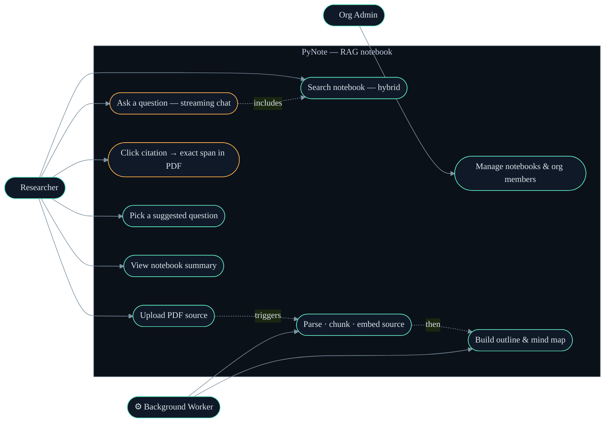
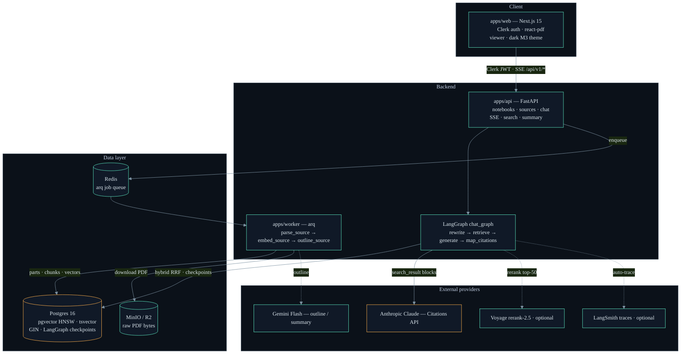
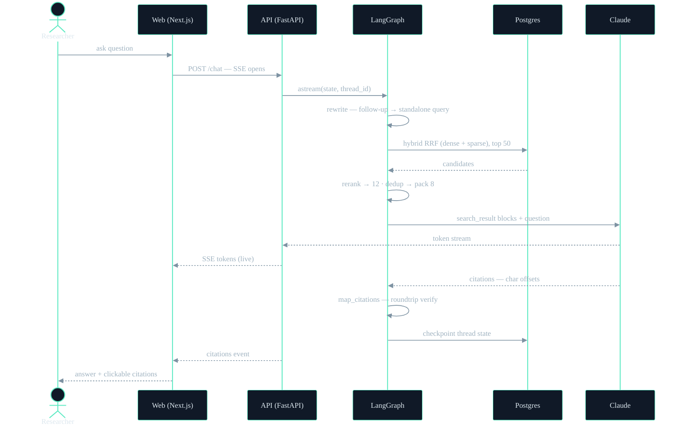

# PyNote — Mermaid Diagrams

Diagrams for the RAG teach-in presentation. GitHub renders these natively;
in VS Code use the built-in Markdown preview (with Mermaid support) or paste
into <https://mermaid.live> to export SVG/PNG at any size.

Each diagram carries an `init` block matching the deck's Control Room palette
(`#0B1119` background, `#5EEAC3` teal, `#FFB04C` amber) so exported images
drop into the slides without restyling.

---

## 1. Use case diagram

Mermaid has no native use-case type; this is the conventional flowchart
approximation — actors outside the system boundary, use cases inside.

---

## 2. Architecture diagram

---

## 3. Chat query flow (sequence)

---

## 4. Ingestion pipeline (flow)

```mermaid
%%{init: {'theme':'base','themeVariables':{
  'primaryColor':'#101927','primaryTextColor':'#DCE7EE','primaryBorderColor':'#5EEAC3',
  'lineColor':'#7E93A3','clusterBkg':'#0B1119','clusterBorder':'#3A4A5A',
  'fontFamily':'IBM Plex Mono','fontSize':'15px'}}}%%
flowchart LR
    pdf[/"PDF upload"/] --> parse["parse_source
    PyMuPDF · strip boilerplate
    de-hyphenate · detect headings"]
    parse --> parts[("source_part
    clean text + heading offsets")]
    parts --> chunker["structure-aware chunker
    paragraphs pack → sentences split
    headings = hard cuts"]
    chunker --> embed["embed_source
    BGE-small 384-d · fastembed
    header: title › section path"]
    embed --> chunks[("chunk table
    HNSW dense · GIN sparse
    meta.section_path")]
    chunks --> outline["outline_source
    suggested-question chips"]

    style chunker stroke:#FFB04C
    style embed stroke:#FFB04C
```

